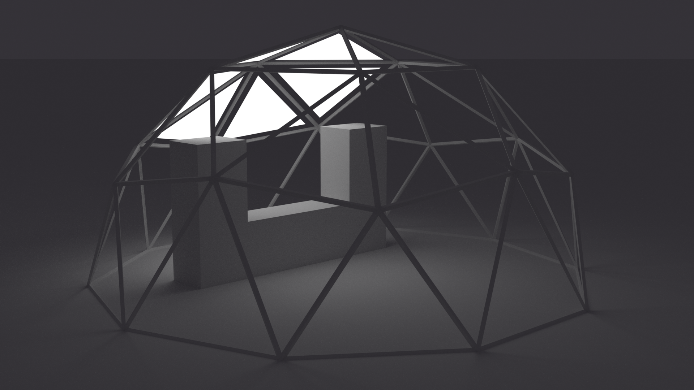
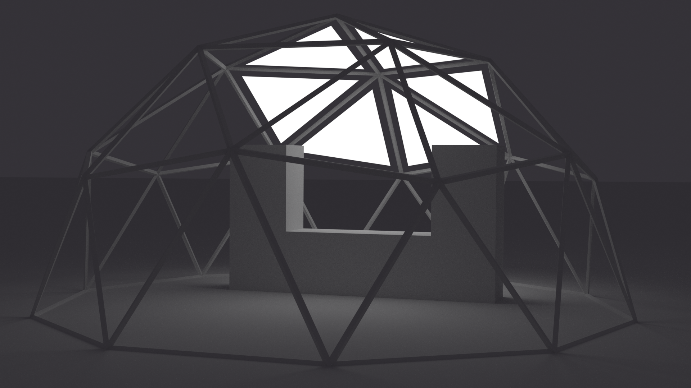

# Flavius LEDPortal

This is a fork of the excellent [LX Studio](http://lx.studio/) by Heronarts, Please read the [copyright and licensing notices](#lx-studio-notices) at the bottom of this readme.

## LEDPortal

LEDPortal is an interactive LED art project started by the Flavius theme camp for Burning Seed in 2020.

Some videos of development progress:

- <https://www.instagram.com/p/CC-x_NOnNkP>
- <https://www.instagram.com/p/CBuyp0GHbRQ>

### Prerequisites

This has only been tested on MacOS, if you're a Java wizard, you may be able to get it working on other platforms

- Install [Processing](https://processing.org/)
- Install Processing Video library: **Sketch** → **Import Library** → **Add Library**
- Java JDK 1.8 (included with Processing on MacOS)
- Some kind of Java wizard who knows about classpaths

### Usage

Open this repo with Eclipse and hit play. If you're very lucky it might just work.

## LX Studio Notices

**BY DOWNLOADING OR USING THE LX STUDIO SOFTWARE OR ANY PART THEREOF, YOU AGREE TO THE TERMS AND CONDITIONS OF THE [LX STUDIO SOFTWARE LICENSE AND DISTRIBUTION AGREEMENT](http://lx.studio/license).**

Please note that LX Studio is not open-source software. The license grants permission to use this software freely in non-commercial applications. Commercial use is subject to a total annual revenue limit of $25K on any and all projects associated with the software. If this licensing is obstructive to your needs or you are unclear as to whether your desired use case is compliant, contact me to discuss proprietary licensing: mark@heronarts.com

---

[LX Studio](http://lx.studio/) is a digital lighting workstation, bringing concepts from digital audio workstations and modular synthesis into the realm of LED lighting control. Generative patterns, interactive inputs, and flexible parameter-driven modulation — a rich environment for lighting composition and performance.

### Getting Started

LX Studio runs using the Processing 3 framework. This version of the project directly embeds those dependencies and may be run from within a Java IDE,
for larger projects in which the Processing IDE is insufficient. The example project here can be run either using the full Processing-based UI,
or alternatively in a headless CLI-only mode.

To get started, clone this repository and import the project into an IDE like Eclipse or IntelliJ. Configuration files for both are readily
available in the repository.

Documentation is available on the [LX Studio Wiki &rarr;](https://github.com/heronarts/LXStudio/wiki)

Consult the [LX Studio API reference &rarr;](http://lx.studio/api/)

### Contact and Collaboration

Building a big cool project? I'm probably interested in hearing about it! Want to solicit some help, request new framework features, or just ask a random question? Open an issue on the project or drop me a line: mark@heronarts.com

---

HERON ARTS MAKES NO WARRANTY, EXPRESS, IMPLIED, STATUTORY, OR OTHERWISE, AND SPECIFICALLY DISCLAIMS ANY WARRANTY OF MERCHANTABILITY, NON-INFRINGEMENT, OR FITNESS FOR A PARTICULAR PURPOSE, WITH RESPECT TO THE SOFTWARE.
